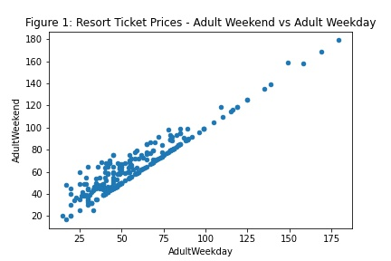
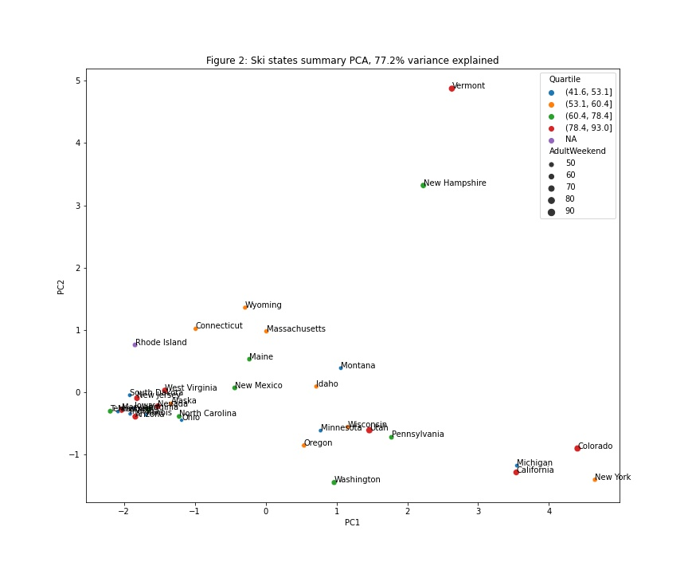
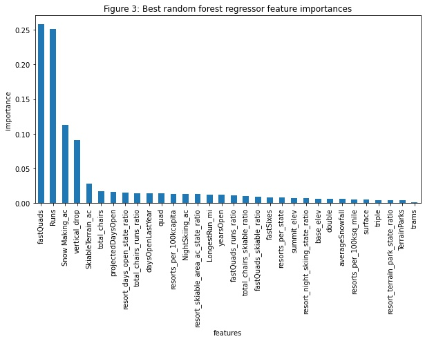
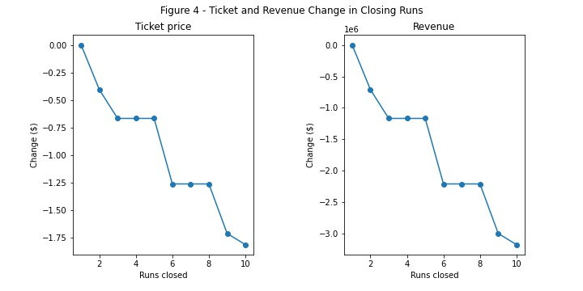

# What are the main features at Big Mountain Resort that drives the optimal ticket price?

## Background
Big Mountain Resort in Montana has recently added a new chair lift to its resort that will increase operating costs by $1.56 million for the upcoming season. Business leaders view their resort as one of the premier resorts in the state, and they set their ticket prices above the state average. Business leaders are wanting to optimize their profits while not increasing prices so high that it deters customers. This analysis will determine which features at Big Mountain Resort provides the most value, and what is the optimal ticket price that business leaders should set to maximize their profits.

## The Dataset
The ski resort dataset features data from 329 resorts from 33 states and providing up to 27 variables (3 categorical, 24 numerical) of information. State information from Wikipedia was also utilized. This main information used from this resource was the 2019 population data and the total area. Two columns in the main dataset were highlighted as the main feature: `AdultWeekday` and `AdultWeekend`. Some resorts have different prices depending on the day of the week; Big Mountain Resort does not. Figure 1 shows that many resorts around the United States do not have different ticket prices due to the day of the week. 

Since Big Mountain Resort does not differentiate, only one ticket price column was used, and since `AdultWeekend` had less missing values than `AdultWeekday` (4 to 7), this analysis only used the `AdultWeekend` price data for this analysis. After evlauting the dataset for completeness and accuracy, 276 resorts and 25 data values were used in the exploratory data analysis.

## Exploratory Data Analysis
The initial exploratory analysis was to determine how much ticket prices were influenced by location. There would be no use to continue to compare Big Mountain Resort to resorts in New York if the resort pricing was largely influenced by the number of customers in their region or due to competition with other local resorts. A PCA test was conducted with 7 parameters: number of resorts, total ski able area , total number of days open by all resorts, total terrain parks, total number of nightskiing nights, number of resorts per 100,000 people, and number of resorts per 100,000 square miles. The two represents 77.2% of the variance in the data and that data is depicted in Figure 2. Also included is the ticket prices colored by quartiles and sized by the nearest 10 dollars. 

Figure 2 does not show any type of pattern or correlation between the ticket price and the geographic factors to suggest that these factors are critical for determining the optimal ticket price. Heatmaps and scatterplots were created to compare variables against the ticket price. Vertical drops, number of runs, guaranteed snow by snow makers, trams, number of runs, and number of fast quad lifts showed positive relationships with ticket price. This suggests that these criteria will be influencers in the models.

## Preprocessing and Modeling
To provide the models a starting point, the weekend ticket prices were averaged and the mean average error for the ticket prices alone was approximately $19 dollars. Therefore, if Big Mountain Resort was pricing their tickets against other resorts solely on the ticket pricing alone, their price could be off the optimal price by that amount. Two models were used in this analysis: linear modeling and random forest modeling. 

The cross validation on linear modeling provided 8 features that made the most critical impact on ticket pricing. Those eight features are vertical drop, acres covered by snow making, total number of chair lifts, total number of fast quad lifts, number of runs, the length of the longest run, number of trams, and acreage of skiiable terrain. Increasing trams or skiiable terrain alone would actually have a negative impact on pricing because that would indicate the resort got larger without providing more access to the new areas.

In figure 3, the random forest model indicated four features that made the largest impact: number of fast quad lifts, number of runs, number of acres covered by snow making, and vertical drop.

These four features were also indicated in the linear model as important features, and the random forest model had a mean average error of nearly $1 less than the linear model. The random forest model will be the model to use to project future pricing for Big Mountain Resort.

## Final Results and Recommendations
When projecting the modelled price for Big Mountain Resort using the random forest model, it projects that Big Mountain Resort should be listing its ticket price at **$95.87**. This does come with a mean average error of **$10.39**. Therefore, if Big Mountain Resort was to go as consevative as possible, they could list their ticket price at $85.48. With a projected 350,000 customers this year, the most conservative increase of $4.48 will provide $1.568 million dollars in new revenue which covers the $1.56 million costs in the new chair lift. 

A few scenarios to also consider when making additional changes. When closing one run, the models suggest that the value of the resort does not go down any. However, closing any additional runs starts to detract value of the resort. Figure 4 shows the impacts on the value lost to Big Mountain Resort by how many runs are closed 

Big Mountain Resort has also suggest adding an additional run that would increase the vertical drop by 150 feet. The additional run, chair and higher drop adds $1.99 ticket value to the resort. Any additional acreage coverage by snow making is negligible with the other additions. It should also be noted that increasing the longest run by length does not add any value, either. Adding height to the vertical drop was the most critical player in these analyses. 

## Future Work
This analysis was entirely conducted on the premise on comparing Big Mountain Resort and its features against other resorts in the United States. This analysis could be improved with some deeper analysis on skill of level of runs. Some runs offer more thrill and/or skill and can command a higher value. Also, while our model is suggesting a detract in resort value by closing multiple runs; this analysis ignores if closing those runs could still be cost effective for the resort. If closing a few certain runs saves more than the resort would lose, then the resort would still be maing a better decision to close them. Refining this model with these additions along with building this model out into a user friendly application will also help business leaders be able to make these decisions more quickly in the future. 
